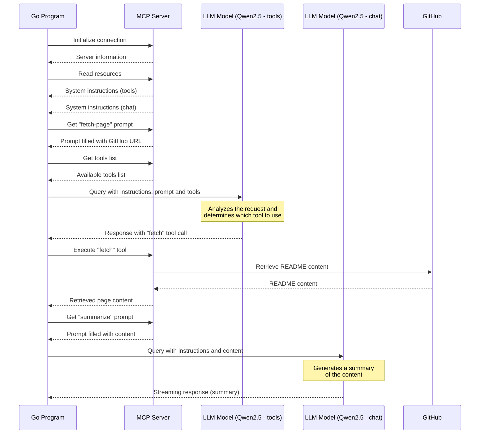

# Using an MCP SSE Server with Parakeet

For the release of version `v0.2.6 🍿 [popcorn]` of Parakeet, I'm explaining how to leverage the power of MCP for your generative AI applications.

As a reminder:

- **[Parakeet](https://github.com/parakeet-nest/parakeet)** is a Go library designed to help you develop generative AI applications with [Ollama](https://ollama.com/). The goal of **Parakeet** is to simplify the development of your application as much as possible. Reading the project [README](https://github.com/parakeet-nest/parakeet?tab=readme-ov-file#-parakeet) is sufficient to get started quickly.

- **[MCP](https://www.anthropic.com/news/model-context-protocol)**, or Model Context Protocol, is an open standard developed by **[Anthropic](https://www.anthropic.com/)** that connects AI assistants to systems where "data lives" (content repositories, professional tools, and development environments). This technology aims to replace fragmented integrations with a universal protocol, allowing AI models to more easily access relevant data to produce higher quality responses.

> If you'd like to read more about MCP, I've also written two blog posts:
> - [Understanding the Model Context Protocol](https://k33g.hashnode.dev/understanding-the-model-context-protocol-mcp)
> - [WASImancer, an MCP server with SSE transport, powered by WebAssembly](https://k33g.hashnode.dev/wasimancer-an-mcp-server-with-sse-transport-powered-by-webassembly)

For this blog post, we'll use **[WASImancer](https://github.com/sea-monkeys/WASImancer)**, which is an MCP server I developed for my own needs. **WASImancer** follows the MCP specification, so it will be very easy to reuse the source code from this article with other MCP servers. The specificity of **WASImancer** is that it operates based on plugins developed in WebAssembly. Configuration and data are defined using yaml files.

## Preparing the MCP Server

The server structure is as follows:

```bash
.
├── server
    ├── compose.yml
    ├── plugins
    │   ├── fetch
    │   │   └── wasimancer-plugin-fetch.wasm
    │   └── plugins.yml
    ├── prompts
    │   └── prompts.yml
    └── resources
        └── resources.yml
```

The server is available here [https://github.com/parakeet-nest/parakeet/tree/main/blogposts/mcp-sample/server](https://github.com/parakeet-nest/parakeet/tree/main/blogposts/mcp-sample/server). 

The objective of this server is to offer several services to your generative AI application:

- Download the content of a web page using the **"fetch"** tool. This tool is a plugin that will be executed on demand by the MCP server. The **"fetch"** plugin is already compiled (`wasimancer-plugin-fetch.wasm` - the plugin code is available).
- Provide text resources, such as system instructions for your LLM.
- Offer prompt templates to help you build prompts for your LLM.

### Configuration

The server is configured through three yaml files:
- `plugins/plugins.yml`
- `resources/resources.yml`
- `prompts/prompts.yml`

Let's look at their respective contents:

#### `plugins.yml`

This file defines where to find the plugin to execute and provides the information necessary to use it, such as the `url` argument of type `string` for the `fetch` function:
```yaml
plugins:

  - name: fetch
    path: /fetch/wasimancer-plugin-fetch.wasm
    version: 1.0.0
    description: fetch the content of a url
    functions:
      - displayName: fetch
        function: fetch
        arguments:
          - name: url
            type: string
            description: url to fetch
        description: fetch the content of a url
```

#### `resources.yml`

This file offers text resources that will be accessible for use by the generative AI application:
```yaml
resources:
  static:
 
    - name: tools system instructions
      uri: tools-system://instructions
      contents:
        - text: | 
            You are a useful AI agent. 
            Your job is to understand the user prompt ans decide if you need to use a tool to run external commands.
            Ignore all things not related to the usage of a tool

    - name: chat system instructions
      uri: chat-system://instructions
      contents:
        - text: | 
            You are a useful AI agent. your job is to answer the user prompt.
            If you detect that the user prompt is related to a tool, ignore this part and focus on the other parts.

```

#### `prompts.yml`

The prompts file offers prompt templates and specifies the variable(s) to interpolate to build the prompt:
```yaml
prompts:
  predefined:

    - name: 'fetch-page'
      arguments:
        - name: 'url'
          type: 'string'
      messages:
        - text: 'Fetch the content of the following url: ${url}'
          role: 'user'

    - name: summarize
      arguments:
        - name: 'content'
          type: 'string'
      messages:
        - text: 'Summarize the following text: ${content}'
          role: 'user'

```

> - For example, for the `fetch-page` prompt, if the value of the `url` variable is `https://docker.com`, the server will return a prompt completed with this value: `Fetch the content of the following url: https://docker.com`
> - You can note that you must specify the `role` of the message, here `user` (you have the choice between `user` and `assistant`).

### Starting the MCP Server

The **WASImancer** server also exists as a Docker image (you can read the [Dockerfile](https://github.com/sea-monkeys/WASImancer/blob/main/Dockerfile) code), so it's very easy to start it with Docker Compose. You'll find the following `compose.yml` file in the `server` folder:

```yaml
services:  
  wasimancer-server:
    image: k33g/wasimancer:0.0.1
    environment:
      - HTTP_PORT=3001
      - PLUGINS_PATH=./plugins
      - PLUGINS_DEFINITION_FILE=plugins.yml
      - RESOURCES_PATH=./resources
      - RESOURCES_DEFINITION_FILE=resources.yml
      - PROMPTS_PATH=./prompts
      - PROMPTS_DEFINITION_FILE=prompts.yml
    ports:
      - 5001:3001
    volumes:
      - ./resources:/app/resources
      - ./plugins:/app/plugins
      - ./prompts:/app/prompts
```

So to start the MCP server, use the following command:

```bash
docker compose up
```

Now that the server is started, let's see how to use **Parakeet** to use the MCP services.

## Initialize the Application

```bash
mkdir demo
cd demo
go mod init mcpdemo
touch main.go
```

And here's the code to connect to the MCP server:

```golang
package main

import (
	"context"
	"fmt"
	"log"
	"time"

	mcpsse "github.com/parakeet-nest/parakeet/mcp-sse"
)

func main() {

	// Create context with timeout
	ctx, cancel := context.WithTimeout(context.Background(), 30*time.Second)
	defer cancel()

	// Create a new mcp client
	mcpClient, err := mcpsse.NewClient(ctx, "http://0.0.0.0:5001")
	defer mcpClient.Close()

	if err != nil {
		log.Fatalln("😡 error when creating the MCP client:", err)
	}

	// Start and initialize the client
	err = mcpClient.Start()

	if err != nil {
		log.Fatalln("😡 error when starting the MCP client:", err)
	}

	result, err := mcpClient.Initialize()

	if err != nil {
		log.Fatalln("😡 error when initializing the MCP client:", err)
	}

	fmt.Println("🚀 Initialized with server:", result.ServerInfo.Name, result.ServerInfo.Version)

}
```

If you run the code, you'll get the following output:

```raw
🚀 Initialized with server: wasimancer-server 0.0.1
```

Let's see how to read the MCP resources.

## How to Read MCP Resources

### Get the List of Resources

To read the resources, add this to the previous code:

```golang
// Get the list of resources
resources, err := mcpClient.ListResources()
if err != nil {
    log.Fatalln("😡", err)
}

// Print the list of available resources
fmt.Println("🌍 Available Static Resources:")
for _, resource := range resources {
    fmt.Printf("- Name: %s, URI: %s \n", resource.Name, resource.URI)
}
```

If you run the code, you'll get the following output:

```raw
🌍 Available Static Resources:
- Name: tools system instructions, URI: tools-system://instructions 
- Name: chat system instructions, URI: chat-system://instructions
```

### Read the Content of Our Two Resources

To read the content of the resources, add this to the previous code:

```golang
fmt.Println("📝 Resources content:")

resourceResult, err := mcpClient.ReadResource("tools-system://instructions")
if err != nil {
    log.Fatalln("😡 Failed to read resource:", err)
}
toolsSystemInstructions := resourceResult.Contents[0]["text"].(string)

resourceResult, err = mcpClient.ReadResource("chat-system://instructions")
if err != nil {
    log.Fatalln("😡", err)
}
chatSystemInstructions := resourceResult.Contents[0]["text"].(string)

fmt.Println("- Tools System Instructions:", toolsSystemInstructions)
fmt.Println("- Chat System Instructions:", chatSystemInstructions)
```

If you run the code, you'll get the following output:

```raw
📝 Resources content:
- Tools System Instructions: You are a useful AI agent. 
Your job is to understand the user prompt ans decide if you need to use a tool to run external commands.
Ignore all things not related to the usage of a tool

- Chat System Instructions: You are a useful AI agent. your job is to answer the user prompt.
If you detect that the user prompt is related to a tool, ignore this part and focus on the other parts.
```

Now let's move on to prompts.

## How to Read MCP Prompts

### Get the List of Prompts

To get the list of prompt templates, add this to the previous code:

```golang
// Get the list of prompts
prompts, err := mcpClient.ListPrompts()
if err != nil {
    log.Fatalln("😡", err)
}

fmt.Println()
fmt.Println("📣 Get the list of the prompts")
for _, prompt := range prompts {
    fmt.Println("- Name:", prompt.Name, "Arguments:", prompt.Arguments)
}
```

If you run the code, you'll get the following output:

```raw
📣 Get the list of the prompts
- Name: fetch-page Arguments: [{url  true}]
- Name: summarize Arguments: [{content  true}]
```

### Get Completed Prompts

To get the completed prompts after variable interpolation, add this to the previous code:

```golang
fmt.Println()
fmt.Println("📝 Fill the fetch-page prompt")

fetchPrompt, err := mcpClient.GetAndFillPrompt("fetch-page", map[string]string{"url": "https://docker.com"})
if err != nil {
    log.Fatalln("😡", err)
}

fmt.Println(
    "📣 Filled Prompt:", 
    "role:", fetchPrompt.Messages[0].Role, 
    "content:", fetchPrompt.Messages[0].Content,
)

fmt.Println()
fmt.Println("📝 Fill the summarize prompt")

summarizePrompt, err := mcpClient.GetAndFillPrompt("summarize", map[string]string{"content": "[this is the content of the page]]"})
if err != nil {
    log.Fatalln("😡", err)
}

fmt.Println(
    "📣 Filled Prompt:", 
    "role:", summarizePrompt.Messages[0].Role, 
    "content:", summarizePrompt.Messages[0].Content,
)

```

If you run the code, you'll get the following output:

```raw
📝 Fill the fetch-page prompt
📣 Filled Prompt: role: user content: Fetch the content of the following url: https://docker.com

📝 Fill the summarize prompt
📣 Filled Prompt: role: user content: Summarize the following text: [this is the content of the page]]
```

Now let's move on to tools.

## Using MCP Tools

### Get the List of Available Tools

To get the list of tools, add this to the previous code:

```golang
fmt.Println()
fmt.Println("🛠️ Get tools list from the MCP server")
ollamaTools, err := mcpClient.ListTools()
if err != nil {
    log.Fatalln("😡", err)
}

for _, tool := range ollamaTools {
    fmt.Println("🛠️ Tool:", tool.Function.Name)
    fmt.Println("  - Arguments:")
    for name, prop := range tool.Function.Parameters.Properties {
        fmt.Println("    - name", name, ":", prop.Type)
    }
}
```

If you run the code, you'll get the following output:

```raw
🛠️ Get tools list from the MCP server
🛠️ Tool: fetch :
  - Arguments:
    - name url : string
```

We can see that we have access to a `fetch` function through a tool that expects a `url` argument of type `string`.

### Let's Ask to Execute the Tool

To execute the tool and retrieve the content of a remote page, add the code below to the previous code:

```golang
fmt.Println()
fmt.Println("🛠️ 📣 calling:")

content, err := mcpClient.CallTool(
    "fetch",
    map[string]interface{}{
        "url": "https://raw.githubusercontent.com/parakeet-nest/parakeet/refs/heads/main/blogposts/mcp-sample/demo/README.md",
    },
)

if err != nil {
    log.Fatalln("😡", err)
}

fmt.Println("🌍 Content:", content.Text)
```

If you run the code, you'll get the following output:

```raw
🛠️ 📣 calling:
🌍 Content: 👋 Hello World 🌍
```

Now we have all the necessary tools to benefit from MCP services. Let's see how to aggregate them for use with LLMs.

## Using MCP Tools and Ollama Together with an LLM

Let's initialize a second application:

```bash
mkdir demo-with-llm
cd demo-with-llm
go mod init mcpllmdemo
touch main.go
```

The code below is a program that demonstrates the use of a communication system between a client and an MCP server to interact with LLMs via Ollama.

So, add the following code (available here [demo-with-llm](https://github.com/parakeet-nest/parakeet/blob/main/blogposts/mcp-sample/demo-with-llm/main.go)):

```golang
package main

import (
	"context"
	"fmt"
	"log"
	"time"

	"github.com/parakeet-nest/parakeet/completion"
	"github.com/parakeet-nest/parakeet/enums/option"
	"github.com/parakeet-nest/parakeet/llm"
	mcpsse "github.com/parakeet-nest/parakeet/mcp-sse"
)

func main() {

	// Create context with timeout
	ctx, cancel := context.WithTimeout(context.Background(), 30*time.Second)
	defer cancel()

	ollamaUrl := "http://localhost:11434"
	modelWithToolsSupport := "qwen2.5:0.5b"
	chatModel := "qwen2.5:0.5b"

	// Create a new mcp client
	mcpClient, err := mcpsse.NewClient(ctx, "http://0.0.0.0:5001")
	defer mcpClient.Close()

	if err != nil {
		log.Fatalln("😡 error when creating the MCP client:", err)
	}

	// Start and initialize the client
	err = mcpClient.Start()

	if err != nil {
		log.Fatalln("😡 error when starting the MCP client:", err)
	}

	result, err := mcpClient.Initialize()

	if err != nil {
		log.Fatalln("😡 error when initializing the MCP client:", err)
	}

	fmt.Println("1. 🚀 Initialized with server:", result.ServerInfo.Name, result.ServerInfo.Version)

	// ------------------------------
	//  List and read the ressources
	// ------------------------------
	fmt.Println("2. 📚 Reading resource from the MCP server...")

	resourceResult, err := mcpClient.ReadResource("tools-system://instructions")
	if err != nil {
		log.Fatalln("😡 Failed to read resource:", err)
	}
	toolsSystemInstructions := resourceResult.Contents[0]["text"].(string)

	resourceResult, err = mcpClient.ReadResource("chat-system://instructions")
	if err != nil {
		log.Fatalln("😡", err)
	}
	chatSystemInstructions := resourceResult.Contents[0]["text"].(string)

	fmt.Println("- 📚 Tools System Instructions:", toolsSystemInstructions)
	fmt.Println("- 📚 Chat System Instructions:", chatSystemInstructions)

	// ------------------------------
	//  List and read the prompts
	// ------------------------------
	fmt.Println("3. 📝 Get tools Prompt from the MCP server...")

	promptForToolsLLM, err := mcpClient.GetAndFillPrompt(
		"fetch-page",
		map[string]string{
			"url": "https://raw.githubusercontent.com/sea-monkeys/WASImancer/main/README.md",
		},
	)
	if err != nil {
		log.Fatalln("😡", err)
	}
	fmt.Println(
		"4. 📣 Filled Prompt:",
		"role:", promptForToolsLLM.Messages[0].Role,
		"content:", promptForToolsLLM.Messages[0].Content,
	)

	fmt.Println("5. 🛠️ Get tools list from the MCP server...")

	// Get the list of tools from the MCP server
	ollamaTools, err := mcpClient.ListTools()
	if err != nil {
		log.Fatalln("😡", err)
	}

	// Prepare messages for the Tools LLM
	messagesForToolsLLM := []llm.Message{
		{Role: "system", Content: toolsSystemInstructions},
	}
	messagesForToolsLLM = append(messagesForToolsLLM, promptForToolsLLM.Messages...)

	// Set options for the Tools LLM
	options := llm.SetOptions(map[string]interface{}{
		option.Temperature: 0.0,
	})

	// Prepare query for the Tools LLM
	toolsQuery := llm.Query{
		Model:    modelWithToolsSupport,
		Messages: messagesForToolsLLM,
		Tools:    ollamaTools,
		Options:  options,
		Format:   "json",
	}

	fmt.Println("6. 📣 Send tools request to the LLM...")
	// Call the Tools LLM
	answer, err := completion.Chat(ollamaUrl, toolsQuery)
	if err != nil {
		log.Fatalln("😡", err)
	}

	// Search tool(s) to call for execution in the answer
	tool, err := answer.Message.ToolCalls.Find("fetch")
	if err != nil {
		log.Fatalln("😡", err)
	}
	fmt.Println("  - 🛠️ Tool to call:", tool)

	fmt.Println("7. 🛠️ Ask the MCP server to execute the fetch tool...")
	// 🖐️ Ask the MCP server to execute the tool
	pageContent, err := mcpClient.CallTool(tool.Function.Name, tool.Function.Arguments)
	if err != nil {
		log.Fatalln("😡", err)
	}
	fmt.Println("  - 🌍 Content length:", len(pageContent.Text))

	fmt.Println("8. 📝 Get chat Prompt from the MCP server...")
	prompt, _ := mcpClient.GetAndFillPrompt(
		"summarize",
		map[string]string{"content": pageContent.Text},
	)

	fmt.Println(
		"  - 📣 Filled Prompt:",
		"role:", prompt.Messages[0].Role,
		"content length:", len(prompt.Messages[0].Content),
	)

	// Prepare messages for the Chat LLM
	messagesForChatLLM := []llm.Message{
		{Role: "system", Content: chatSystemInstructions},
	}
	messagesForChatLLM = append(messagesForChatLLM, prompt.Messages...)

	chatOptions := llm.SetOptions(map[string]interface{}{
		option.Temperature:   0.0,
		option.RepeatLastN:   2,
		option.RepeatPenalty: 2.0,
	})

	query := llm.Query{
		Model:    chatModel,
		Messages: messagesForChatLLM,
		Options:  chatOptions,
	}

	fmt.Println("9. 📣 Send chat request to the LLM and display the summary of the page...")
	// Call the Chat LLM
	_, err = completion.ChatStream(ollamaUrl, query,
		func(answer llm.Answer) error {
			fmt.Print(answer.Message.Content)
			return nil
		})

	if err != nil {
		log.Fatalln("😡", err)
	}

}
```

### Explanations

This code illustrates a complete workflow where a first language model is used to determine which tool to use to retrieve information (in this case, the content of a web page), then a second model is used to summarize this information. All of this is orchestrated by an MCP server that manages resources, prompts, and tool execution.



Here's what the program does step by step:

1. **Initialization**: The program creates an MCP client that connects to a local server on port 5001. It also configures the Ollama URL and specifies two Qwen 2.5 models to use (one for tool support, or "function calling", and another for chat completion).

2. **Reading resources**: The program retrieves system instructions from the MCP server - a set of instructions for an LLM capable of using tools (`tools-system://instructions`) and another set of instructions for general chat (`chat-system://instructions`).

3. **Getting and filling prompts**: The program asks the MCP server to prepare a "**fetch-page**" prompt with a specific GitHub URL (the `README` of the **WASImancer** project).

4. **Using an LLM with tools**: 
   - The code retrieves the list of available tools from the MCP server
   - It sends a request to the first model (with tool support) including system instructions, the prompt, and the list of tools
   - The model responds with a call to the **`fetch`** tool

5. **Executing the tool**: The program asks the MCP server to execute the **`fetch`** tool identified by the model, to retrieve the content of the specified GitHub page (the `README` of the **WASImancer** project).

6. **Generating a summary**: Then,
   - The program obtains a new "**summarize**" prompt from the MCP server and "fills" it with the retrieved page content
   - It prepares a request for the second model (chatModel) with the chat system instructions and the summary prompt
   - It sends this request and displays the summary generated by the model progressively (streaming)

Finally, if you run the program, you'll get the following output:

```raw 
1. 🚀 Initialized with server: wasimancer-server 0.0.1
2. 📚 Reading resource from the MCP server...
- 📚 Tools System Instructions: You are a useful AI agent. 
Your job is to understand the user prompt ans decide if you need to use a tool to run external commands.
Ignore all things not related to the usage of a tool

- 📚 Chat System Instructions: You are a useful AI agent. your job is to answer the user prompt.
If you detect that the user prompt is related to a tool, ignore this part and focus on the other parts.

3. 📝 Get tools Prompt from the MCP server...
4. 📣 Filled Prompt: role: user content: Fetch the content of the following url: https://raw.githubusercontent.com/sea-monkeys/WASImancer/main/README.md
5. 🛠️ Get tools list from the MCP server...
6. 📣 Send tools request to the LLM...
  - 🛠️ Tool to call: {{fetch map[url:https://raw.githubusercontent.com/sea-monkeys/WASImancer/main/README.md]} <nil> <nil>}
7. 🛠️ Ask the MCP server to execute the fetch tool...
  - 🌍 Content length: 2488
8. 📝 Get chat Prompt from the MCP server...
  - 📣 Filled Prompt: role: user content length: 2518
9. 📣 Send chat request to the LLM and display the summary of the page...
WASImancer is a WebAssembly-powered Model Context Protocol (MCP) server that enhances tool execution through WebAssembly plugins. It is built with Node.js and Extism, enabling seamless integration of WebAssembly modules as plugin functions. WASImancer provides fast, near-native performance, language-agnostic plugin development, secure sandboxed execution environment, seamless integration with the Model Context Protocol, easy extensibility through the Extism plugin framework, and a start-up process that can be used to test WASImancer.
```

And there you have it! Now you have the necessary elements to experiment more deeply on the subject of MCP. See you soon for another article.
