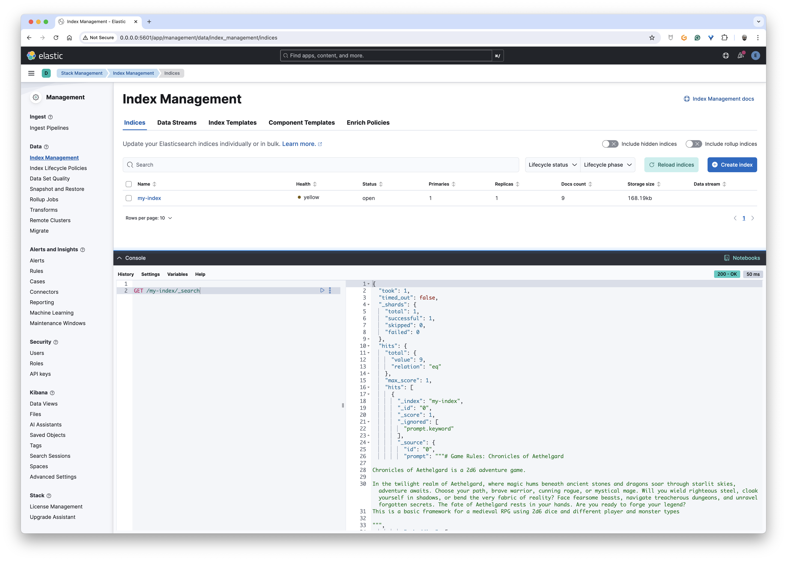

# How to run this example

https://www.elastic.co/guide/en/elasticsearch/reference/current/docker.html

## Elastic
To store embeddings in Elasticsearch using the Golang client, you'll need to follow these steps:

```bash
docker network create elastic
docker run --name es01 --net elastic -p 9200:9200 -it -m 1GB docker.elastic.co/elasticsearch/elasticsearch:8.15.0
```

Wait until you get this messages into the log:
```bash

━━━━━━━━━━━━━━━━━━━━━━━━━━━━━━━━━━━━━━━━━━━━━━━━━━━━━━━━━━━━━━━━━━━━━━━━━━━━━━━━━━━━━━━━━━━━━━━━━━━━━━━━━━━━━━━━━━━━━━━━━━━━━━━━━━━━━━━━━━━━━━━━━━━━━━━━━━━━━━━━━━━━━━━━━━━━━━━━━━━━━━━━━━━━━━━━━━━━━━━━━━━━━━━━━━━━━━━━━━━━━━━━━━━━━━━━━━━━━━━━━━━━━━━━━━━
✅ Elasticsearch security features have been automatically configured!
✅ Authentication is enabled and cluster connections are encrypted.

ℹ️  Password for the elastic user (reset with `bin/elasticsearch-reset-password -u elastic`):
  6Ss3QDrIvz1P7Uukyqfq

ℹ️  HTTP CA certificate SHA-256 fingerprint:
  25e35d7f3d3d715599860f1e1a8e56aec88c5e137ccd1e63c54c0d8378fb3cda

ℹ️  Configure Kibana to use this cluster:
• Run Kibana and click the configuration link in the terminal when Kibana starts.
• Copy the following enrollment token and paste it into Kibana in your browser (valid for the next 30 minutes):
  eyJ2ZXIiOiI4LjE0LjAiLCJhZHIiOlsiMTcyLjI4LjAuMjo5MjAwIl0sImZnciI6IjI1ZTM1ZDdmM2QzZDcxNTU5OTg2MGYxZTFhOGU1NmFlYzg4YzVlMTM3Y2NkMWU2M2M1NGMwZDgzNzhmYjNjZGEiLCJrZXkiOiJVZXZpYzVFQldEcFR1b25wZzEwSTpldHF0c1REcFNOaVNGUFdGVzRxbkxBIn0=

ℹ️ Configure other nodes to join this cluster:
• Copy the following enrollment token and start new Elasticsearch nodes with `bin/elasticsearch --enrollment-token <token>` (valid for the next 30 minutes):
  eyJ2ZXIiOiI4LjE0LjAiLCJhZHIiOlsiMTcyLjI4LjAuMjo5MjAwIl0sImZnciI6IjI1ZTM1ZDdmM2QzZDcxNTU5OTg2MGYxZTFhOGU1NmFlYzg4YzVlMTM3Y2NkMWU2M2M1NGMwZDgzNzhmYjNjZGEiLCJrZXkiOiJVdXZpYzVFQldEcFR1b25wZzEwSToyRFdKMVlMc1RGQ0VVVU9QTm9VZlBnIn0=

  If you're running in Docker, copy the enrollment token and run:
  `docker run -e "ENROLLMENT_TOKEN=<token>" docker.elastic.co/elasticsearch/elasticsearch:8.15.0`
━━━━━━━━━━━━━━━━━━━━━━━━━━━━━━━━━━━━━━━━━━━━━━━━━━━━━━━━━━━━━━━━━━━━━━━━━━━━━━━━━━━━━━━━━━━━━━━━━━━━━━━━━━━━━━━━━━━━━━━━━━━━━━━━━━━━━━━━━━━━━━━━━━━━━━━━━━━━━━━━━━━━━━━━━━━━━━━━━━━━━━━━━━━━━━━━━━━━━━━━━━━━━━━━━━━━━━━━━━━━━━━━━━━━━━━━━━━━━━━━━━━━━━━━━━━

```

> if needed to reset the password:
> ```bash
> docker exec -it es01 /usr/share/elasticsearch/bin/elasticsearch-reset-password -u elastic
> ```

## Generate a certificate for HTTP

```bash
docker cp es01:/usr/share/elasticsearch/config/certs/http_ca.crt .
```

### Test the connection with the certificate

```bash
export ELASTIC_PASSWORD=6Ss3QDrIvz1P7Uukyqfq
curl --cacert http_ca.crt -u elastic:$ELASTIC_PASSWORD https://localhost:9200
```

You should get something like this:
```bash
{
  "name" : "602f990409e9",
  "cluster_name" : "docker-cluster",
  "cluster_uuid" : "IaF2jmr0SwS8RrsiHMrDcw",
  "version" : {
    "number" : "8.15.0",
    "build_flavor" : "default",
    "build_type" : "docker",
    "build_hash" : "1a77947f34deddb41af25e6f0ddb8e830159c179",
    "build_date" : "2024-08-05T10:05:34.233336849Z",
    "build_snapshot" : false,
    "lucene_version" : "9.11.1",
    "minimum_wire_compatibility_version" : "7.17.0",
    "minimum_index_compatibility_version" : "7.0.0"
  },
  "tagline" : "You Know, for Search"
}
```


## Kibana

```bash
docker run --name kib01 --net elastic -p 5601:5601 docker.elastic.co/kibana/kibana:8.15.0
```

Wait until this message into the logs:
```bash
http://0.0.0.0:5601/?code=076483
```

- Go to http://0.0.0.0:5601/?code=076483
- Copy paste the Kibana token and click on "Configure Elastic" button
- Log in with `elastic` and the password you got from the Elasticsearch logs

## Run the example

This example demonstrates how to store embeddings in Elasticsearch and perform a vector similarity search using the Go client.

### Create the embeddings

```bash
cd create-embeddings

ELASTIC_USERNAME=elastic \
ELASTIC_PASSWORD=6Ss3QDrIvz1P7Uukyqfq \
ELASTIC_ADDRESS=https://localhost:9200 \
ELASTIC_CERT_PATH=../http_ca.crt \
go run main.go
```

### Check if the embeddings are stored

- Go to Kibana: http://0.0.0.0:5601/app/management/data/index_management/indices
- Open the console and run the following query:
    ```bash
    GET /chronicles-index/_search
    ```
You should see the embeddings stored in the index `chronicles-index`:



### Perform a vector similarity search

```bash
cd use-embeddings

ELASTIC_USERNAME=elastic \
ELASTIC_PASSWORD=6Ss3QDrIvz1P7Uukyqfq \
ELASTIC_ADDRESS=https://localhost:9200 \
ELASTIC_CERT_PATH=../http_ca.crt \
go run main.go
```

[This program](use-embeddings/main.go) completes the prompt: "Tell me more about Keegorg". If everything works, you'll see it answered from embeddings derived from [chronicles.md](create-embeddings/chronicles.md).

While your results may vary, here's an example output:
```
🔎 searching for similarity...
📝 doc: 8 score: 1.5084158
📝 doc: 2 score: 1.3561833
📝 doc: 4 score: 1.1796646

🤖 answer:
Keegorg is a Senior Solution Architect at Docker, known for his expertise in Docker Compose and Kubernetes. He is a master of the art of leveraging technology to solve complex problems and build highly scalable, resilient systems. Keegorg is known for his ability to think outside the box and come up with innovative solutions to complex problems.
```
