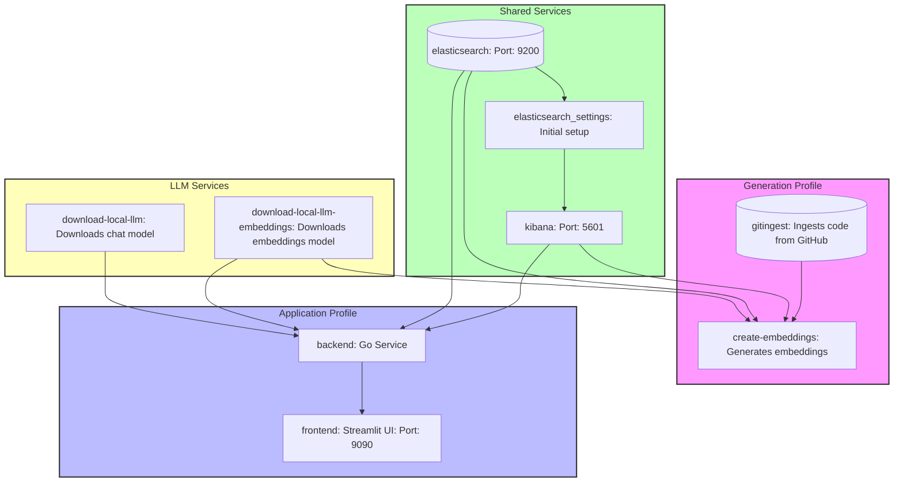

# Chat with your code



## Development mode

If you are working on a release, to test this sample:
```bash
# Embeddings generation then start the application:
docker compose -f compose.dev.yml --profile generation --profile application up --build 

# Start the application only:
docker compose -f compose.dev.yml --profile application up --build 
```

## Production mode

If you are using the current release, to run this sample:
```bash
# Embeddings generation then start the application:
docker compose --profile generation --profile application up --build 

# Start the application only:
docker compose --profile application up --build 
```

## Questions examples


1. For Understanding Package Structure:
```
Based on the repository structure, what are the main packages and their primary responsibilities in the Parakeet project?
```

```
Can you explain the different storage implementations available in the embeddings package?
```

2. For Technical Implementation Details:
```
How does the chat completion functionality work in this project? Please explain the key components and flow.
```

```
What are the different types of vector stores supported by this project, and how are they implemented?
```

3. For Finding Specific Features:
```
Show me how function calling is implemented in this project. What are the different approaches used?
```

```
How does the project handle RAG (Retrieval-Augmented Generation)? What different chunking strategies are available?
```

4. For Understanding Examples:
```
What are the main types of examples provided in the repository, and what capabilities do they demonstrate?
```

```
Can you explain how the embeddings functionality is demonstrated in the example files?
```

5. For Architecture Understanding:
```
What different types of interfaces and core data structures are defined in the project?
```

```
How does the project handle different LLM providers like Ollama and OpenAI?
```

Tips for crafting effective prompts:
1. Be specific about what part of the code you want to understand
2. Ask about relationships between different components
3. Request explanations of specific implementations
4. Ask about specific features and their usage
5. Request comparisons between different approaches used in the code

Example of a complex, well-structured prompt:
```
I want to understand the RAG implementation in this project:
1. What different chunking strategies are available?
2. How are embeddings created and stored?
3. How is similarity search implemented?
4. What are the different vector store options?
Please provide specific references to relevant code components.
```

These prompts will help you get comprehensive information about the codebase while maintaining focus on specific aspects you want to understand.